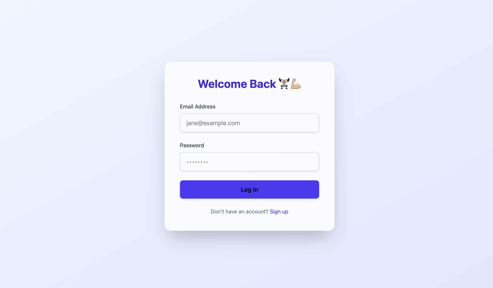
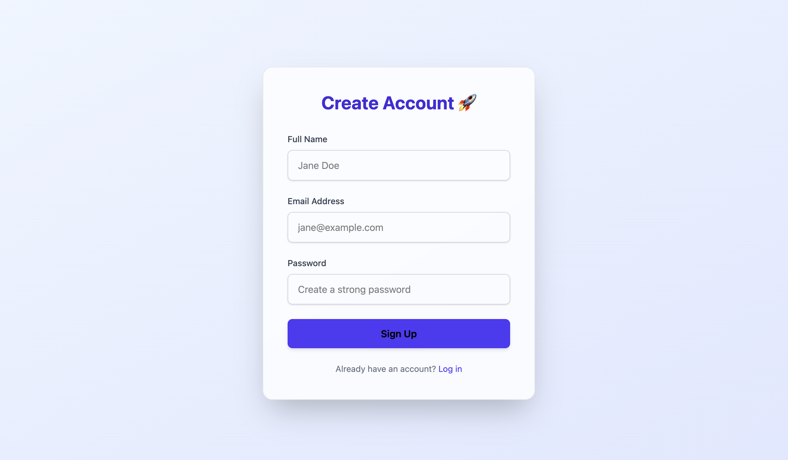
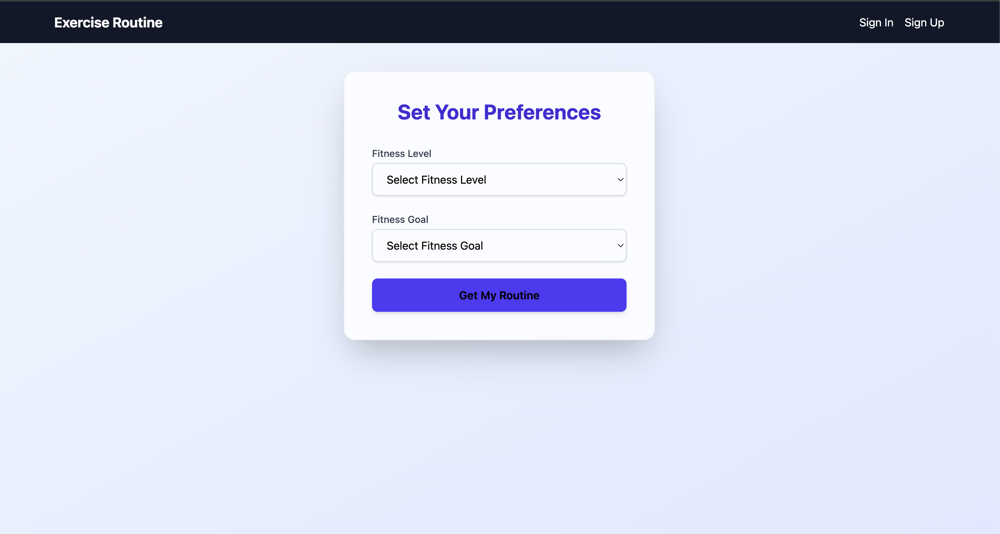
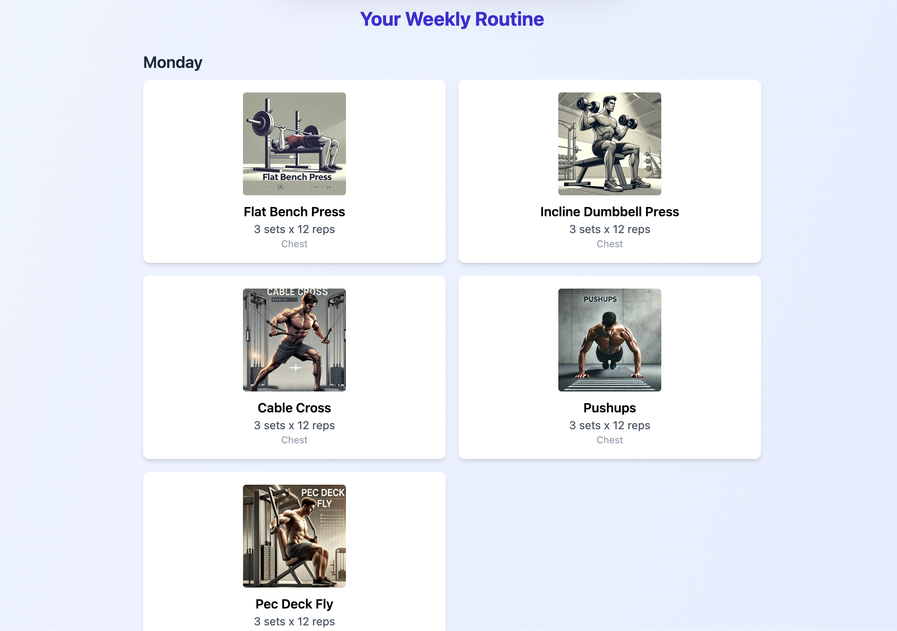

# 🏋️‍♂️ Fitness Planner Web App

A full-stack fitness application that generates weekly personalized workout routines based on user preferences.

---

## 🚀 Features

- 🔐 User Authentication (Signup/Login with JWT)
- 🎯 Fitness Level & Goal selection post-login
- 📆 Dynamic 6-day weekly workout routine
- 🖼️ Images for each exercise, stored locally in `/public/images`
- 🎨 Responsive and modern UI with Tailwind CSS
- 🔧 Modular architecture with clean backend & frontend separation

---

## 🛠 Tech Stack

**Frontend:** React, Tailwind CSS, React Router  
**Backend:** Node.js, Express.js, MongoDB, JWT  
**Database:** MongoDB Atlas  
**Other:** Axios, dotenv

---

## 📸 UI Screenshots

### 🔐 Login Page


### 📝 Signup Page


### ⚙️ Preference Selection


### 📆 Weekly Routine with Exercise Images


---

## 🧾 Image Handling

- All exercise images are stored in the frontend’s `public/images/` folder.
- Image filenames **exactly match the exercise names** (e.g., `Pushups.webp`).
- This approach is ideal for local development and GitHub-hosted demos.


---

## 📁 Folder Structure

```
frontend/
  └── public/
      └── images/         # Holds all .webp exercise images
  └── src/
      ├── pages/
      ├── components/
      ├── api/
      └── utils/
backend/
  └── src/
      ├── models/
      ├── routes/
      └── controllers/
```

---

## ✅ How It Works

1. User signs up with basic info
2. Selects fitness level & goal post-login
3. Routine is selected from a preloaded set of 9 templates (3x3 combinations)
4. Each day's exercises are displayed with images, name, sets/reps, and targeted muscle group

---

## 📦 Data Source

- `Exercise` model holds all routines and image paths
- `Routine` model maps user to a selected routine template
- Image links are local paths based on matching filenames

---

## 👏 Credits

Built for a Hackathon Project  
Design inspired by fitness-oriented UI from AI-generated concepts
